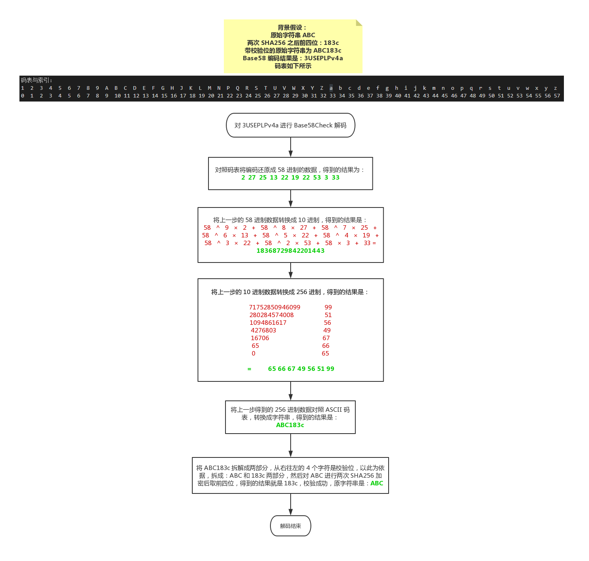
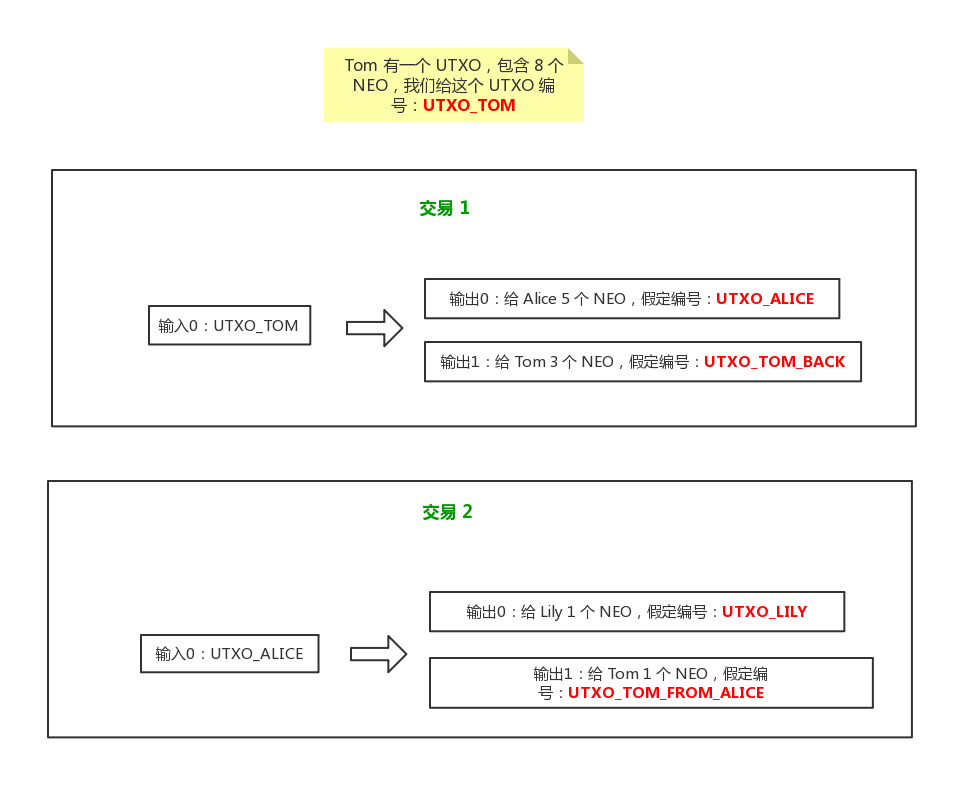

## homework 1

### 1. 画出Base58Check的解码过程流程图

详情见图 decode-base58check.jpg



---

### 2. 编码实现，梅克尔树根节点hash值计算。假设叶子节点为三笔交易，字节分为为: 0x0000, 0x1111, 0x2222

计算结果是：04bbfbd2c04273ad6d1d1096d00cb023aaf92e4fff06712fe445c49a3940fa1c

详情见代码文件 calculate_merkle_root.py

``` python
import hashlib


## 本代码适用于 Python 3.7 及以上的版本
## 先来写一个例子，说明一下 NEO 上的 Merkle Root 具体是怎么算的
## 这里用 NEO 主网上索引为 3939253 的区块作为例子
def sha256(data):
    return hashlib.new('sha256', data).digest()


def dsha256(data):
    return sha256(sha256(data))


## 该区块中共有两笔交易，一笔是 miner，一笔是 claim，交易ID分别是
tx1 = '3604c1c303bf056069741d0113a868e942d6a7522c07ce46c3b38ad2ad5aef27'
tx2 = '1a5c21216d433fada9ae6f77cfd0a2aeb6f07b3c7d93d43611cef8866e4c80a2'

## 根据区块浏览器显示，该区块的 Merkle Root 为：
## 0x1507333569eaf461b4e63a64c4cfb37562912bb72ec5731119a3408338df11ea

## 这里我用的机器是小端，现在来取两笔交易的ID的 bytes
tx1_ = bytes.fromhex(tx1)[::-1]
tx2_ = bytes.fromhex(tx2)[::-1]

## 只有两笔交易，也就是两个叶子节点，往上推一层就直接得到 Merkle Root
r = dsha256(tx1_ + tx2_)
merkle_root = bytes.hex(r[::-1])
print('3939253区块手动计算结果', merkle_root)
## 这里得到的结果与区块浏览器完全一致

#################################################################################

## 下面直接用最简单的递归开始正式编码
## 已知某区块有 3 笔交易，其ID如下，第4个是第3个的复制品
## 要求此区块的 Merkle Root


def to_little_endian(txid_list):
    return [bytes.fromhex(txid)[::-1] for txid in txid_list]


def dhash256(txid_left, txid_right):
    return dsha256(txid_left + txid_right)


def calc_merkle_root(txid_list):
    if len(txid_list) == 1:
        return bytes.hex(txid_list[0][::-1])

    temp_hash_list = []

    # 叶子节点两两 double sha256
    for i in range(0, len(txid_list)-1, 2):
        temp_hash_list.append(dhash256(txid_list[i], txid_list[i+1]))

    # 若奇数叶子节点
    if len(txid_list) % 2 == 1:
        temp_hash_list.append(dhash256(txid_list[-1], txid_list[-1]))

    # 放掉递归
    return calc_merkle_root(temp_hash_list)


## 先用用主网 3939252 上的区块做测试，计算 Merkle Root
example_txid_list = ['3604c1c303bf056069741d0113a868e942d6a7522c07ce46c3b38ad2ad5aef27', '1a5c21216d433fada9ae6f77cfd0a2aeb6f07b3c7d93d43611cef8866e4c80a2']
example_merkle_root = calc_merkle_root(to_little_endian(example_txid_list))
print('3939253区块自动计算结果', example_merkle_root)
## 得到的结果完全正确

## 下面开始解决作业的问题
hw_txid_list = ['0000', '1111', '2222', '2222']
hw_merkle_root = calc_merkle_root(to_little_endian(hw_txid_list))
print('作业自动计算结果', hw_merkle_root)

```

---

### 3. 画图描述一笔UTXO的流通。Tom最开始有8个NEO，转账给Alice 5个Neo，Alice再将其中的1个NEO转给Lily，1个给了Tom。

详情见图 utxo.jpg

